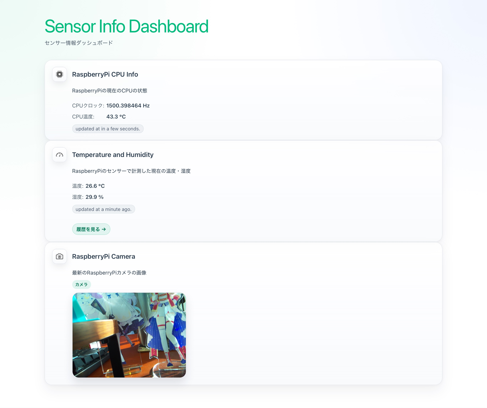

# Sensor Info Dashboard

Raspberry Pi のセンサー情報を表示する Vue 3 の SPA です。



## 概要

- `Home` では CPU 情報、温度・湿度、カメラ画像の概要を表示します
- `Temphistory` では温度・湿度の履歴を表示します
- `Camera` では Raspberry Pi カメラ画像と姿勢推定の切り替えを行います

## 動作環境

- Node.js 24 以上
- pnpm 9 以上
- Vue 3
- Vue Router 4
- TypeScript 5.9 系

## 前提

このアプリが参照する API サーバーを別途起動しておく必要があります。

- https://github.com/MineAP/home-sensor-api

## セットアップ

```sh
pnpm install
```

## 環境変数

プロジェクトルートに `.env` を作成し、API の接続先を設定します。

```env
VITE_API_HOST=http://localhost:3000
```

## 開発

```sh
pnpm run dev
```

## チェックとビルド

```sh
pnpm run type-check
pnpm run build
```

## プレビュー

```sh
pnpm run preview
```
